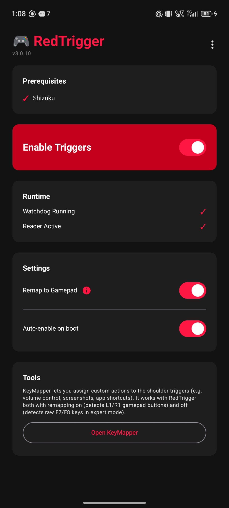
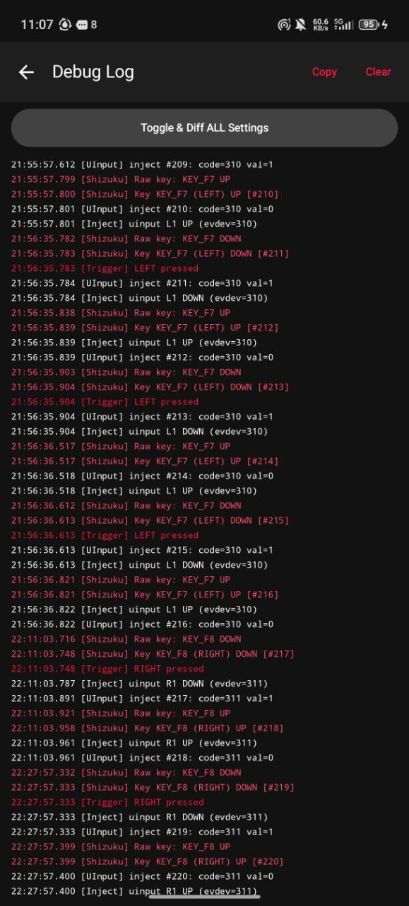
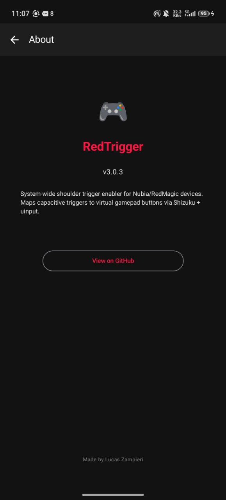

<p align="center">
  
</p>

<p align="center">
  <a href="#how-it-works">How It Works</a> •
  <a href="#requirements">Requirements</a> •
  <a href="#setup">Setup</a> •
  <a href="#building">Building</a> •
  <a href="#architecture">Architecture</a>
</p>

<p align="center">
  
  
  
  
</p>

---

Android app that enables shoulder triggers (SAR capacitive sensors) on Nubia Red Magic phones system-wide, without needing Game Space.

## Screenshots

<p align="center">
  
  &nbsp;&nbsp;
  
  &nbsp;&nbsp;
  
</p>

## The Problem

Nubia's game framework controls the shoulder trigger hardware. Triggers only work inside Game Space, and the system resets trigger settings every time you switch apps. RedTrigger fixes both issues.

## How It Works

1. Sets `nubia_game_scene=1` to activate SAR sensors without launching full Game Space
2. Runs a foreground service with a ContentObserver watchdog that detects when Nubia's SystemMgr resets the setting (on every `notifyActivityResumed`)
3. Re-applies trigger settings instantly, keeping triggers active across all apps

### Key Remapping (via Shizuku)

The Nubia game service intercepts the raw trigger keys (F7/F8) and converts them to screen taps. RedTrigger works around this by:

- Reading raw input events from `/dev/input/eventX` using a Shizuku UserService (`getevent`)
- Optionally injecting remapped key events (L1/R1) so apps like [KeyMapper](https://github.com/keymapperorg/KeyMapper) can capture them
- Using a virtual `uinput` device for injection so events appear as real hardware input

## Requirements

- Nubia Red Magic phone (tested on Red Magic 11 Pro)
- [Shizuku](https://shizuku.rikka.app/) installed and running

## Setup

1. Install the APK
2. Install and start [Shizuku](https://shizuku.rikka.app/) (wireless ADB or root)
3. Open RedTrigger and grant Shizuku permission when prompted
4. Tap "Enable Triggers"

RedTrigger automatically grants itself the required `WRITE_SECURE_SETTINGS` permission via Shizuku, so no manual ADB commands are needed.

The watchdog service starts automatically and persists across app switches. Enable "Auto-enable on boot" in the app to survive reboots.

## Building

Requires Android SDK and JDK 17.

```bash
# Using justfile (recommended)
just build        # Build debug APK
just ship         # Build + copy to shared storage
just version      # Show current version
just bump-patch   # 3.0.0 → 3.0.1
just bump-minor   # 3.0.0 → 3.1.0
just clean        # Clean build artifacts

# Or directly with Gradle
ANDROID_HOME=/path/to/android-sdk \
JAVA_HOME=/path/to/jdk-17 \
./gradlew assembleDebug --no-daemon --no-configuration-cache
```

APK output: `app/build/outputs/apk/debug/RedTrigger-v{version}.apk`

## Architecture

| Component | Description |
|-----------|-------------|
| `TriggerManager` | Reads/writes Android Global Settings to enable/disable triggers |
| `TriggerService` | Foreground service with ContentObserver watchdog |
| `InputReader` | Manages Shizuku UserService lifecycle (app process) |
| `InputService` | Shizuku UserService that reads `/dev/input/eventX` (Shizuku process) |
| `uinput_injector` | Native C binary that creates a virtual gamepad via `/dev/uinput` |
| `BootReceiver` | Re-enables triggers on device boot |
| `DebugLog` | In-app log buffer with color-coded UI display |

Communication between the app process and Shizuku process uses AIDL:
- `IInputService.aidl` — app → Shizuku (start/stop, config)
- `ITriggerCallback.aidl` — Shizuku → app (trigger events, debug)

### SAR Input Devices

The shoulder triggers appear as capacitive touch sensors:
- Left trigger (SAR0) → `KEY_F7`
- Right trigger (SAR1) → `KEY_F8`
- Device names contain `nubia_tgk_aw_sar`

## Tech Stack

- Kotlin + Jetpack Compose
- Material 3
- Shizuku API
- Native C (uinput virtual gamepad)
- Android SDK 35 (min SDK 29)

## License

[MIT](LICENSE) © Lucas Zampieri
